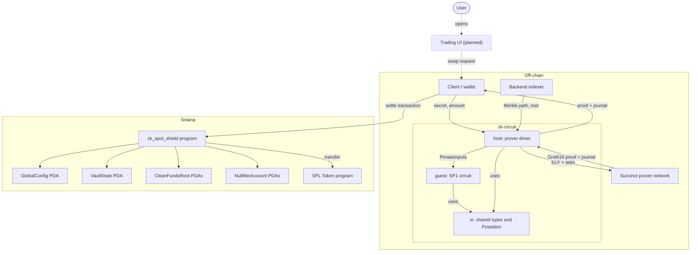
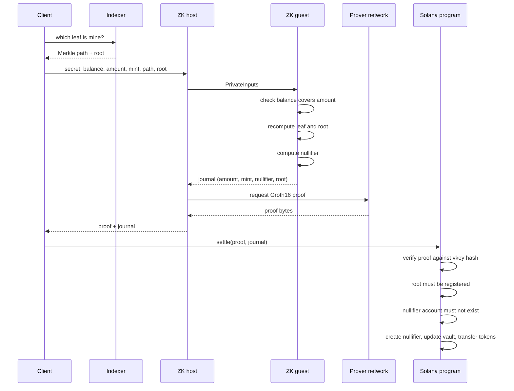
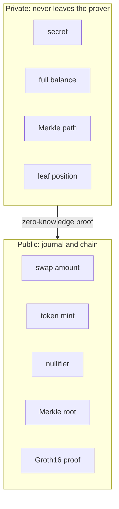

# Architecture

The system has three parts. The **client** holds the user's secret note. The **ZK circuit** turns private data into a proof. The **Solana program** checks the proof and settles.

## Components

Dotted boxes and arrows are planned and not built yet. Solid ones exist in the repo today.

## Settlement flow

## What stays private

## Repository layout

| Folder | Role |
| --- | --- |
| `programs/zk_spot_shield/` | Anchor program `zk_spot_shield` (on-chain) |
| `zk-circuit/io/` | Shared input/output types and Poseidon Merkle helpers, used by both guest and host |
| `zk-circuit/guest/` | SP1 guest: the circuit that runs inside the zkVM |
| `zk-circuit/host/` | Host: feeds inputs to the guest, runs execute or requests a proof |
| `zk-circuit/fixtures/happy/` | Recorded Groth16 proof, journal, and verifying key from one real remote proof |
| `client/` | Client helpers (placeholder for the future SDK) |

See [Security](security.md) for the attack-surface table (threat, mitigation, recovery).
