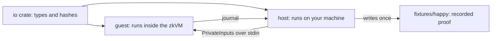

# Guest and Host Program Design

The zero-knowledge side uses [SP1](https://docs.succinct.xyz/), a zkVM: you write ordinary Rust, it compiles to RISC-V, and SP1 can prove that the program ran correctly on some hidden input. Three crates split the work.

## `zk-circuit/io`: one source of truth

Both sides must hash and lay out data the same way, or proofs fail for confusing reasons. So `io` owns:

- `PrivateInputs`: the witness the guest reads (shown with real values on [Tests](tests.md)).
- `PublicOutputs`: the journal the guest commits and the chain will read.
- Poseidon helpers: `compute_leaf`, `hash_nodes`, `verify_merkle_path`, `compute_nullifier`, and `index0_empty_path` for test trees.

The crate has no zkVM dependency, so it compiles natively and its unit tests run in CI in seconds. Poseidon (BN254, circom-compatible) is chosen because it is cheap inside proof systems, unlike SHA-256.

## `zk-circuit/guest`: the circuit

The guest is short. It reads `PrivateInputs`, enforces three rules, and commits four public values.

1. **Solvency**: `balance >= requested_swap_amount`, otherwise panic.
2. **Membership**: recompute `leaf = Poseidon(secret, user_address, balance)`, then hash up the 20-level path to a root. It must equal `expected_root`, otherwise panic.
3. **Nullifier**: `Poseidon(secret, leaf, asset_id_mint)`.

If every check passes, the guest commits the journal. If any check fails, the guest panics, and a panicked run cannot produce a valid proof. That is what "fail closed" means here.

Fixed-size arrays everywhere (`[u8; 32]`, a `[_; 20]` path) keep the guest free of heap allocation, which keeps the cycle count down.

## The journal: what the chain will see

The journal is exactly 104 bytes:

| Bytes | Field | Type |
| --- | --- | --- |
| 0..8 | `requested_swap_amount` | little-endian `u64` |
| 8..40 | `asset_id_mint` | 32 bytes |
| 40..72 | `nullifier` | 32 bytes |
| 72..104 | `merkle_root` | 32 bytes |

`PublicOutputs::from_journal_bytes` decodes this layout and rejects any other length.

## `zk-circuit/host`: the driver

The host builds `PrivateInputs`, hands them to the guest over SP1 stdin, and reads back the journal. It has two modes:

| Mode | What runs | Cost | How |
| --- | --- | --- | --- |
| **Execute** (default) | Guest runs in the zkVM, no proof | Free, local | `cargo run -p zk-circuit-host --release` |
| **Remote Groth16** | Succinct prover network produces a proof | Paid in `$PROVE` | `--features network` plus env flags |

A Groth16 wrap needs more memory than a typical laptop has, so real proofs go to the Succinct network. The `network` Cargo feature is off by default. It pulls in a large dependency tree that only the remote path needs.

## Fixtures: prove once, test forever

One remote proof of the happy-path input was made and saved under `zk-circuit/fixtures/happy/`:

| File | Contents |
| --- | --- |
| `groth16.bin` | 356-byte Groth16 proof |
| `journal.bin` | 104-byte journal |
| `vkey.bytes32.txt` | Verifying-key hash `0x00b3a15c...35d7` |

Tests read these bytes instead of proving again. That keeps CI offline, free, and deterministic. The bytes come from toy test values, not real funds.
